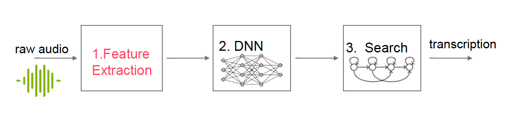

# Grundlagen Der Automatischen Spracherzeugung: 2024-ase-gruppe 777

## Content

Dieses Repository basiert auf dem Kurs [Grundlagen Der Automatischen Spracherzeugung](https://moseskonto.tu-berlin.de/moses/modultransfersystem/bolognamodule/beschreibung/anzeigen.html?number=41121&version=1&sprache=1). Das Ziel ist es, eine Transkription aus einem rohen Audiosignal zu erstellen. 

 

Zudem wird jede Woche die zu bearbeiteten Übungsaufgaben auf diesem Repository hochgeladen. Der Zeitplan für die Aufgaben wird in der folgenden Tabelle festgehalten:

| Übungsaufgaben                  | Start Bearbeitung    | Deadline Bearbeitung    | Abgabe Datum    | 
|---------------------------------|----------------------|-------------------------|-----------------|
| Übung 1                         | 30.10.2024           | ...                     | ...             | 
| Übung 2                         | ...                  | ...                     | ...             |
| Übung 3                         | ...                  | ...                     | ...             |
| Übung 4                         | ...                  | ...                     | ...             |
| Übung 5                         | ...                  | ...                     | ...             |
| Übung 6                         | ...                  | ...                     | ...             |
| Übung 7                         | ...                  | ...                     | ...             |
| Übung 8                         | ...                  | ...                     | ...             |
| Übung 9                         | ...                  | ...                     | ...             |
| Übung 10                        | ...                  | ...                     | ...             |
| Übung 11                        | ...                  | ...                     | ...             |

## Hybride Spracherkennung

Der Prozess der Hybriden Spracherkennung besteht aus drei Hauptschritten (Feature Extraction, Deep Neural Network und Search), die nacheinander ausgeführt werden. Das Ziel ist es aus einem rohen Audiosignal eine Transkription zu erzeugen. 

